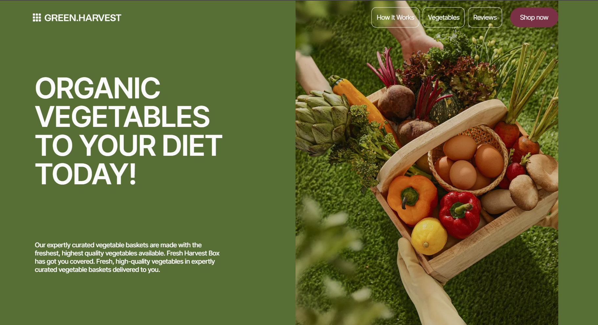

# 🌿 Green Harvest - Promotional Landing Page
Green Harvest is a responsive landing page for an organic store, created with a focus on visual aesthetics, accessibility, and mobile optimization.

🔗 [Live Demo](https://green-harvest-jet.vercel.app/)  

---



## ✨ Main features:
- Modern responsive design (mobile-first)

- Accessible semantics and button-sounding

- Clean layout with a focus on CTA

- Validation order form (modal)


## ⚙️ Tech Stack

- **React** — UI
- **TypeScript** — strict typing
- **Tailwind CSS** — for styles
- **Formik** — form state
- **Yup** — input validation
- **Zustand** — state management
- **React-responsive** — adaptive styles
- **Swiper** — slider for reviews
- **Clsx** — for conditional display of styles
- **React icons** — icons for buttons
- **Vercel** — for deployment

---

## 🚀 Run Locally

1. Clone the repository:
   ```bash
   git clone https://github.com/sofi-dobriak/green-harvest.git
2. Navigate to the project folder:
    ```bash
    cd green-harvest
3. Install dependencies:
    ```bash
    npm install
4. Start the development server:
    ```bash
    npm run dev

5. Open in your browser:
    ```bash
    http://localhost:5173

---

## 💻 My other projects

### ⛵️ Yacht adventures — Landing Page

[Demo](https://yachtjet-mu.vercel.app/) |
[Github](https://github.com/sofi-dobriak/yachtjet)

---

👩‍💻 Author: Sofi Dobriak